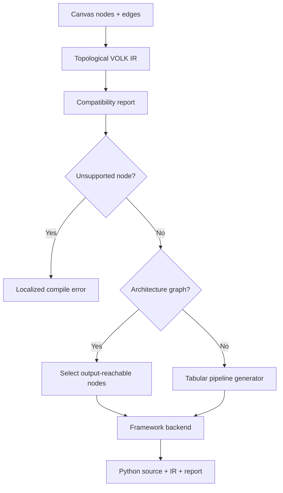

# VOLK IR and dual compiler

The compiler in `src/core/compiler.js` converts a React Flow canvas graph into framework-neutral VOLK IR, then generates PyTorch or TensorFlow/Keras Python source.

## Public API

```js
graphToIR(nodes, edges)
compatibilityReport(nodes, framework)
compileGraph(nodes, edges, framework)
compilePipelineToPyTorch(nodes, edges)
compilePipelineToTensorFlow(nodes, edges)
```

`compileGraph` returns:

```js
{
  code,   // generated Python source
  ir,     // VOLK IR used for generation
  report  // per-node conversion quality
}
```

## VOLK IR v2

IR nodes are topologically ordered and contain semantic information rather than framework classes:

```js
{
  version: 2,
  nodes: [{
    id: 'dense-1',
    op: 'dense',
    componentId: 'dense_node',
    kind: 'layer',
    parameters: {
      input_features: 32,
      units: 64,
      use_bias: true
    },
    inputs: [{
      source: 'input-1',
      sourceHandle: 'tensor',
      targetHandle: 'input'
    }]
  }]
}
```

The IR must remain independent of `torch`, `tensorflow`, React, and UI localization. Increment the IR version when persisted or externally consumed semantics become incompatible.

## Compilation flow



Compilation rejects cycles. Unsupported compatibility stops the selected framework rather than silently omitting behavior.

## Architecture graph selection

Architecture candidates have kinds `source`, `layer`, `merge`, `sink`, or `composite`.

The compiler:

1. finds declared `model_output` nodes;
2. walks backward through their IR inputs;
3. emits only reachable architecture nodes;
4. requires at least one reachable `tensor_input`.

This rule intentionally ignores disconnected experimental layers on the canvas. Do not change it to compile every architecture node: orphan nodes have no valid forward input and would produce invalid source.

Loss and optimizer nodes are configuration nodes rather than architecture nodes. The first matching configured loss/optimizer is used; defaults are MSE and Adam when absent.

## Backend structure

PyTorch generation creates:

- imports;
- reusable helper modules needed by composites;
- `VOLKModel(nn.Module)`;
- layer initialization in `__init__`;
- a topologically ordered `forward`;
- loss and optimizer configuration.

TensorFlow generation creates:

- imports;
- reusable Keras helper layers;
- layer objects;
- `keras.Input` tensors;
- functional graph expressions;
- `keras.Model`;
- `model.compile`.

Tensor input shape strings are converted to Python tuples. Node IDs are sanitized before being used as generated variable names.

## Semantic conversion rules

- Apply parameter adaptations explicitly in backend helpers.
- Reflect known differences in the manifest compatibility value.
- Preserve multi-input ordering through target port names such as `a` and `b`.
- Preserve declared model outputs; multiple outputs become a tuple/list.
- Review sequence-layer output structures rather than assuming both frameworks return the same object.

Binary cross entropy has an output-sensitive rule:

- a `Sigmoid → Model Output` path emits `nn.BCELoss()` and `BinaryCrossentropy(from_logits=False)`;
- a logits output emits `nn.BCEWithLogitsLoss()` and `BinaryCrossentropy(from_logits=True)`.

Keep loss/activation combinations semantically aligned in both backends.

## Tabular compatibility path

When no architecture candidates exist, compilation uses the current tabular regression generator. It reads split ratio, learning rate, and epoch settings from semantic IR operations.

Generated tabular source contains a `load_tabular_data()` placeholder. The exported project JSON remains the data source; code generation does not embed user data.

The in-browser tabular executor is separate and lives in `src/main.jsx`.

## Adding an operation

1. Add the manifest and compatibility metadata.
2. Add initialization and/or forward-expression mappings for PyTorch.
3. Add initialization and/or functional-expression mappings for TensorFlow.
4. Handle framework-specific outputs and parameter semantics.
5. Update training configuration if it is a loss or optimizer.
6. Add representative source assertions for both frameworks.
7. Include disconnected-node coverage when graph reachability could change.
8. Parse representative generated Python when syntax construction changes.

Do not add backend class names or templates to the manifest. Manifests describe semantics; backend code owns source generation.

## Current limitations

- No general shape-inference or static type-inference pass exists.
- Generated neural code does not include a complete data pipeline or training loop.
- Compatibility is component-level rather than dependent on a complete graph pattern, except for explicit rules such as binary cross entropy.
- Invalid edge references are primarily prevented by the canvas/browser validator; the IR builder currently ignores edges whose endpoint node is missing.
- The tabular generator is a specialized compatibility path, not yet expressed as general neural architecture IR.
