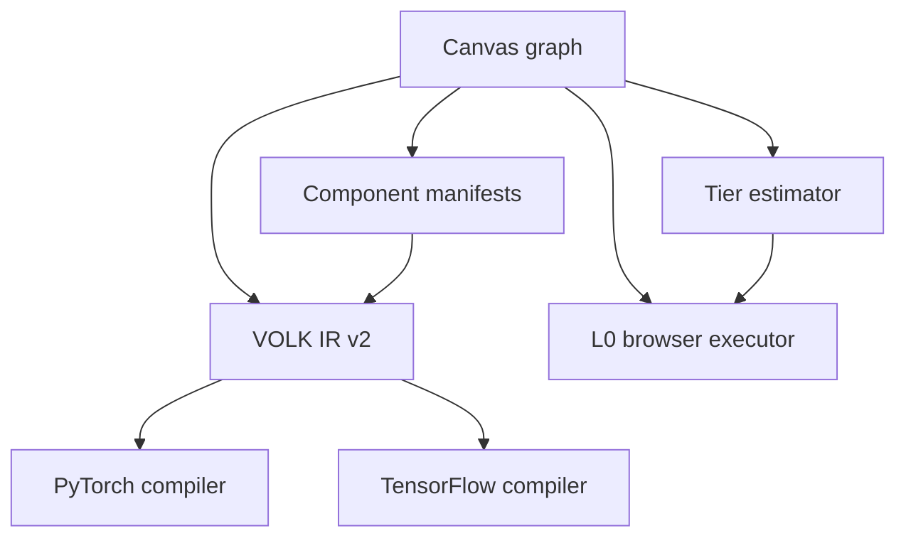

# VOLK-ML architecture

This document is the entry point for changes that cross subsystem boundaries. Read a more specific document when the task is limited to components, compilation, or execution tiers.

## Product boundary

VOLK-ML is a mobile-friendly visual ML builder with three distinct responsibilities:

1. represent a model or training pipeline as a framework-neutral graph;
2. compile supported graphs to PyTorch or TensorFlow/Keras source;
3. execute a deliberately small L0 subset directly in the browser.

Source compilation does not imply browser executability. L1–L3 currently guide export and environment selection rather than providing an in-app runtime.

## Active source map

| Area | Source of truth | Responsibility |
| --- | --- | --- |
| Application shell and browser runner | `src/main.jsx` | React Flow canvas, mobile UI, project import/export, L0 regression execution |
| Component registry | `src/core/components.js` | Manifest schema, basic components, composite definitions, expansion |
| Framework-neutral compiler | `src/core/compiler.js` | VOLK IR, graph selection, compatibility report, PyTorch and TensorFlow generation |
| Workload guidance | `src/core/runtimeTiers.js` | Parameter/operation estimates and L0–L3 recommendation |
| Localization runtime | `src/i18n.js` | Message resolution, localized errors, parallel-language rendering |
| UI messages | `src/locales/ui.js` | Active English and Chinese UI copy |
| Core contract tests | `scripts/check-core.mjs` | Registry, compiler, composite, localization, and tier regression checks |
| Deployment | `.github/workflows/pages.yml` | Build and deploy `dist` to GitHub Pages after a push to `main` |

The TypeScript prototype under `src/` and old plugin JSON files are not the active runtime. Do not update them as a substitute for changing the files above.

## Data flow



- Canvas nodes retain their manifest and user parameters.
- Project JSON stores the graph, workspace preferences, dataset, and trained L0 model.
- `PROJECT_VERSION` in `src/main.jsx` is currently `4`.
- Import resolves persisted manifest IDs against the current registry and fills new properties with current defaults.

## Runtime boundaries

The browser runner in `src/main.jsx` is separate from `src/core/compiler.js`.

- The browser runner validates typed connections and executes only implemented browser backends.
- The compiler generates Python source and never calls the browser runner.
- The tier estimator can recommend an environment even when no runtime for that environment exists in the UI.
- A component may be designable and exportable while having `browserBackend: "none"`.

Do not make an unavailable backend appear runnable. Update availability only when an end-to-end runtime, UI path, and validation exist.

## Change routing

| Change | Read next | Usually update |
| --- | --- | --- |
| Add a layer, loss, optimizer, or composite | `component-manifest.md` | Registry, compiler mappings, tests, localization when UI copy changes |
| Fix PyTorch/TensorFlow conversion | `compiler-ir.md` | Compiler and focused source assertions |
| Change “too large for browser” behavior | `execution-tiers.md` | Tier estimator, UI messages, threshold tests |
| Add a browser-executable algorithm | All three documents | Manifest runtime metadata, browser runner, estimator, tests |
| Change project JSON | This document and relevant subsystem document | `PROJECT_VERSION`, importer, exporter, compatibility behavior |
| Change visible UI | `AGENTS.md` localization section | JSX and `src/locales/ui.js` |

## Validation baseline

```bash
npm run check
npm run build
git diff --check
```

Generated framework code should also receive focused assertions. When a compiler change affects Python syntax, parse representative generated source with Python `ast.parse`.

## Current intentional limitations

- Only the connected tabular linear-regression pipeline runs in the browser.
- Browser WebGPU, local Python orchestration, and remote GPU execution are not implemented.
- Exported neural-network code requires the user to bind a dataset and training loop.
- Shape inference is not yet a first-class IR pass; several layer dimensions remain explicit component properties.
- Framework conversion quality is declared per component and may be `adapted`, `approximate`, or `unsupported`.
