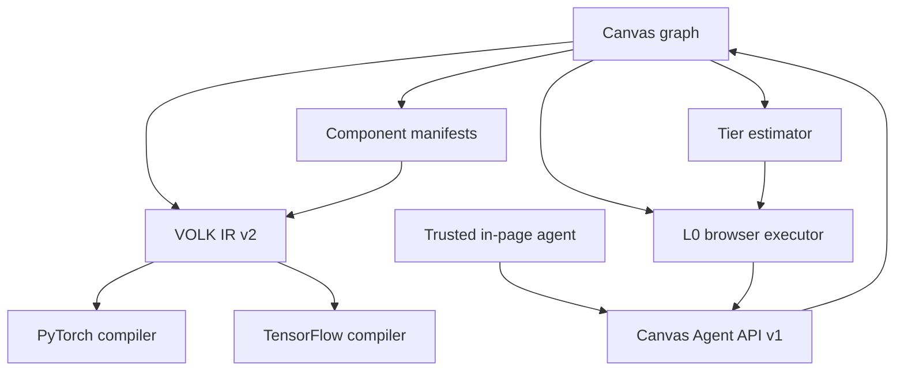

# VOLK-ML architecture

This document is the entry point for changes that cross subsystem boundaries. Read a more specific document when the task is limited to components, compilation, or execution tiers.

## Product boundary

VOLK-ML is a mobile-friendly visual ML builder with three distinct responsibilities:

1. represent a model or training pipeline as a framework-neutral graph;
2. compile supported graphs to PyTorch or TensorFlow/Keras source;
3. execute deliberately small regression and classification L0 pipelines directly in the browser.

Source compilation does not imply browser executability. L1–L3 currently guide export and environment selection rather than providing an in-app runtime.

## Active source map

| Area | Source of truth | Responsibility |
| --- | --- | --- |
| Application shell | `src/main.jsx` | React Flow canvas, mobile UI, project import/export, runner presentation |
| Canvas Agent API | `src/core/canvasAgent.js`, `src/main.jsx` | Versioned in-page inspection, graph commands, execution status, source export, and project download |
| Visual language | `src/core/visualLanguage.js`, `src/components/VisualGlyph.jsx` | Stable stage colors, static canvas glyphs, animated teaching glyphs, architecture layout |
| Project explanation | `src/core/explanation.js`, `src/components/ExplanationDialog.jsx` | Deterministic graph reading plus optional user-supplied conversational model API |
| Custom composites | `src/core/customComposites.js` | User-created nested composite definitions and transparent runtime/compiler expansion |
| Local project storage | `src/core/localProjects.js` | IndexedDB auto-save, restore, safe filenames, and local-file fallback |
| Browser runtime | `src/core/browserRuntime.js`, `src/core/browserExecutionContract.js` | One shared execution contract plus linear regression, KNN classification, small tabular MLP training, evaluation, prediction |
| Component registry | `src/core/components.js` | Manifest schema, basic components, composite definitions, expansion |
| Component tutorials | `src/core/tutorials.js` | Localized beginner explanations, formulas, examples, and visual type per semantic operation |
| Tutorial UI | `src/components/TutorialDialog.jsx` | Mobile-friendly teaching dialog and simplified visual explanations |
| Framework-neutral compiler | `src/core/compiler.js` | VOLK IR, graph selection, compatibility report, PyTorch and TensorFlow generation |
| Workload guidance | `src/core/runtimeTiers.js` | Parameter/operation estimates and L0–L3 recommendation |
| Teaching datasets | `src/core/teachingDatasets.js` | Deterministic seeded datasets for example projects and playgrounds |
| Example quality | `src/core/exampleQuality.js` | Pure teaching-contract checks (class balance, leakage, nonlinearity, R²) |
| Hosted-service boundary | `src/platform/services.js` | Versioned account, project, collaboration, and compute provider contract with local defaults |
| Localization runtime | `src/i18n.js` | Message resolution, localized errors, parallel-language rendering |
| UI messages | `src/locales/ui.js` | Active English and Chinese UI copy |
| Playground framework | `src/core/playgrounds/` (compat), `src/core/playground/` (runtime) | Registry, unified session reducer, model adapters, semantic traces, visualization scripts/presets |
| Playground views | `src/components/playground/` | Unified stage + primitive renderers (never import model math) |
| Playground agent | `src/core/playgroundAgent.js`, `src/core/playgroundHost.js` | Optional `canvas.playground` namespace backed by the same unified runtime as the UI |
| Core contract tests | `scripts/check-core.mjs` | Registry, compiler, composite, localization, and tier regression checks |
| Deployment | `.github/workflows/pages.yml` | Build and deploy `dist` to GitHub Pages after a push to `main` |

The TypeScript prototype under `src/` and old plugin JSON files are not the active runtime. Do not update them as a substitute for changing the files above.

## Data flow


```mermaid
flowchart TD
    A["Canvas graph"] --> B["Component manifests"]
    A --> C["VOLK IR v2"]
    B --> C
    C --> D["PyTorch compiler"]
    C --> E["TensorFlow compiler"]
    A --> F["Tier estimator"]
    A --> G["L0 browser executor"]
    H["Trusted in-page agent"] --> I["Canvas Agent API v1"]
    I --> A
    G --> I
    F --> G
```

- Canvas nodes retain their manifest and user parameters.
- The mounted workspace exposes a serializable canvas snapshot and validated commands through `globalThis.__VOLK_ML_AGENT__`; it does not expose React internals or create a network listener.
- Nodes expose direct learn/delete actions; custom deletable edges expose a midpoint delete action with a wide touch target.
- Project JSON version 8 stores the project name, graph, custom composite definitions, workspace preferences, dataset, and trained L0 model. Browser MLP persistence keeps inference layers, normalization, labels, and metrics while omitting optimizer moment state; imported models are validated against their Trainer graph and dataset before use.
- `PROJECT_VERSION` in `src/core/project.js` is currently `8`.
- Import first migrates legacy graph contracts, then resolves persisted manifest IDs against the current registry and fills new properties with current defaults.
- Version 5 migrates legacy KNN `model` edges to `trained_model`; obsolete visualization-only `boundary` edges are removed because the current KNN runtime no longer produces a mesh.
- Version 6 adds the project name and reusable custom-composite catalog.
- Version 7 moves only the untouched built-in sample graph to wider coordinates so enlarged component cards do not overlap; user-arranged graphs keep their positions.

## Visual workspace

- Canvas components reserve their rightmost 30% for a lightweight static semantic glyph. Animation is never active on the canvas.
- Every registered operation has its own semantic visual. The same visual vocabulary becomes animated only inside the component guide after the learner presses play; activation curves are sampled from their mathematical functions rather than hand-drawn approximations.
- The linear-regression guide includes a lazy-loaded playground. It uses the first feature and target from the current regression dataset (or local example points), samples large datasets evenly over sorted x values, and recomputes the line, residuals, and MSE as weight or bias changes.
- Stage color has one stable meaning: green for data, blue for models, orange for training, and violet for outputs. Runtime status remains a separate ring.
- The component library is a collapsible stage → category tree. Deleting a saved custom definition removes it from the reusable catalog but deliberately keeps existing canvas instances intact.
- The architecture view derives topological layers from the same graph without changing saved node positions.
- Neural training keeps model definition and runtime data binding separate. `Tensor Input → layers → Model Output` defines the model, while Supervised Trainer explicitly joins that `ModelSpec` with `DatasetSplit`, `LossSpec`, and `OptimizerSpec`. The small sequential tabular MLP subset can run at L0; the wider Trainer contract generates an L2 Python training loop.
- Custom Loss expressions use a small framework-neutral tensor DSL and are parsed before export; project JSON never executes user-authored JavaScript or injects raw Python.
- Custom composites are copy-style definitions. They can contain preset or custom composites, expand for editing, collapse to their original instance, and flatten recursively before execution or source compilation.
- Project explanation begins with deterministic topology and connection analysis. A user may optionally provide a compatible chat-completion endpoint, model name, and in-memory API key for follow-up questions.

## Playgrounds

- A playground is an interactive, deterministic concept lab for one component or task. It is reached from a component tutorial through the playground registry; the tutorial itself never special-cases a model.
- Linear Regression and KNN both run on the same unified playground runtime (`src/core/playground/playgroundRuntime.js`); each model contributes a Model Adapter, and teaching flows are JSON Visualization Script presets. UI, Canvas Agent and script runtime dispatch the same JSON actions, so recorded teaching scenarios and agent demos are reproducible (same script + seed + data → same trace).
- The unified stage only knows JSON primitives; model adapters never import React and renderers never import model mathematics.
- Playground sessions are temporary: they are never written to project JSON and never mutate the canvas graph. Data is captured as a source snapshot; workspace changes mark it stale until `refreshSource()`.
- Only playgrounds animate. Canvas glyphs stay static. See [`docs/architecture/playgrounds.md`](playgrounds.md).

## Canvas connection rules

- Connections remain nominally type-safe: ports connect only when their exact semantic types match. VOLK-ML does not silently coerce tables, tensors, model specifications, or trained models.
- One input accepts one incoming edge, while one output may fan out to several consumers.
- Self-connections and connections that would introduce a graph cycle are rejected before they reach compilation or browser execution.
- The canvas shows localized, human-readable port roles while keeping stable internal type identifiers in saved projects.
- Future flexibility should come from explicit adapter components or a shape-inference pass, not implicit conversions that hide graph semantics.

## Runtime boundaries

The browser runtime in `src/core/browserRuntime.js` is separate from `src/core/compiler.js`.

## Build and Explore workspace ownership

The active Build and Explore surfaces share reusable definitions and the
existing playground runtime primitives, but never share active mutable
environment state.

- Build Workspace is a free construction environment for the graph, dataset,
  model, and browser runtime.
- Explore Workspace is a controlled inquiry environment owned by its
  Playground/Big Idea session. An Explore Environment Recipe describes the
  intended reproducible setup; it is not the learner's Explore Session or
  inquiry history.
- Build environment changes are not Explore condition changes. Navigation does
  not synchronize or rebase either environment.
- Interoperability is an explicit import/fork boundary. A compatibility-gated
  “Explore this setup” action creates a new custom Explore workspace; an
  unsupported Build configuration is explained and is not presented as a
  compatible exploration.

Each built-in Explore session uses its own host and resolves its source from
its recipe/default rather than the active Build dataset. The host exposes a
bounded environment identity for compatibility checks. A mismatch is a
recovery condition: it cannot silently continue or rewrite evidence,
hypotheses, Test Designs, counterfactuals, interpretations, or Inquiry
Episodes that belong to the original Explore environment.

Workspace lifecycle is explicit. Built-in recipe sessions are `persistent`:
closing the dialog retains the host and its session-local inquiry context for
reopen. An explicit Build → Explore fork is `ephemeral`; closing it disposes
the host, removes its routing entry, and clears the active Agent reference.
The fork registry uses bounded keys and disposes older ephemeral forks before
activating another one, so opening custom explorations cannot accumulate
unbounded hosts. Strict Explore opening rejects a host/playground mismatch;
recovery must explicitly restore the intended recipe before the dialog opens.

- The browser runtime validates typed connections and executes only implemented browser backends.
- The compiler generates Python source and never calls the browser runner.
- The tier estimator can recommend an environment even when no runtime for that environment exists in the UI.
- A component may be designable and exportable while having `browserBackend: "none"`.

Do not make an unavailable backend appear runnable. Update availability only when an end-to-end runtime, UI path, and validation exist.

- Validation and runtime failures highlight only the components the execution contract can attribute the failure to. Dataset-level and graph-level errors (missing data, no edges, no training root) surface the error message without painting canvas nodes red.

## Change routing

| Change | Read next | Usually update |
| --- | --- | --- |
| Add a layer, loss, optimizer, or composite | `component-manifest.md` | Registry, compiler mappings, tests, localization when UI copy changes |
| Fix PyTorch/TensorFlow conversion | `compiler-ir.md` | Compiler and focused source assertions |
| Change “too large for browser” behavior | `execution-tiers.md` | Tier estimator, UI messages, threshold tests |
| Add a browser-executable algorithm | All three documents | Manifest runtime metadata, browser runner, estimator, tests |
| Add cloud storage, collaboration, or remote execution | `platform-services.md` | External provider implementation plus contract tests |
| Change agent canvas commands or snapshots | `agent-canvas-api.md` | Pure command helpers, workspace adapter, API version, and contract tests |
| Change project JSON | This document and relevant subsystem document | `PROJECT_VERSION`, importer, exporter, compatibility behavior |
| Change visible UI | `AGENTS.md` localization section | JSX and `src/locales/ui.js` |
| Change a component lesson | `component-manifest.md` | Tutorial catalog, tutorial coverage tests, and dialog only when presentation changes |

## Teaching examples

- Every bundled example has a teaching role (Concept / Applied / Architecture Sketch), a deterministic seeded dataset, and a machine-verifiable teaching contract checked at generation time and in `npm run check`.
- Data is generated before labels, so no example leaks the answer into its inputs. See [`docs/teaching-examples.md`](../teaching-examples.md).

## Validation baseline

```bash
npm run check
npm run build
git diff --check
```

Generated framework code should also receive focused assertions. When a compiler change affects Python syntax, parse representative generated source with Python `ast.parse`.

## Current intentional limitations

- Connected tabular linear-regression, KNN-classification, and the documented small sequential MLP pipelines run in the browser.
- Browser WebGPU, local Python orchestration, and remote GPU execution are not implemented.
- A connected Supervised Trainer exports a complete single-input/single-output tabular training loop. Architecture-only exports still leave dataset binding and the loop to the user.
- Shape inference is not yet a first-class IR pass; several layer dimensions remain explicit component properties.
- Framework conversion quality is declared per component and may be `adapted`, `approximate`, or `unsupported`.
- The optional conversational explanation endpoint must support a chat-completion request shape and browser CORS; no API key is persisted.
- The Canvas Agent API controls one mounted browser workspace and has no remote authentication or transport. External agent hosts must provide those boundaries themselves.
